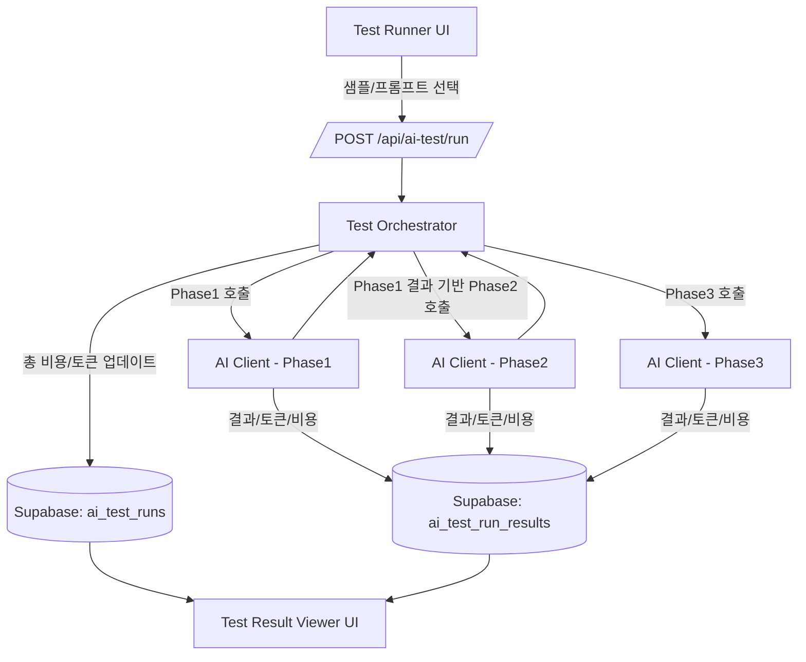

# Prompt Test Engine Architecture
**Component:** AI Test Lab (Internal Tool)
**Related Document:** `ai-spec.md`
**Last Updated:** 2025-12-07

본 문서는 프롬프트 버전을 실험하고, 비용과 품질을 정량적으로 비교하기 위한 **"프롬프트 테스트 전용 랩(Lab)"** 시스템의 아키텍처를 정의한다.

실제 서비스와 **동일한 AI 파이프라인(Client/Orchestrator)**을 사용하되, **저장소와 실행 흐름만 분리**하여 안전하게 실험할 수 있는 환경을 구축한다.

---

## 1. 구성 요소 (Components)

### 1.1 Test Runner UI (Next.js Page)
- **위치:** `/lab` 또는 별도 어드민 라우트
- **기능:**
  - 테스트 샘플 선택 (Pre-defined Samples)
  - Phase별 프롬프트 버전 선택 (Selector)
  - “테스트 실행” 트리거
  - 실시간 실행 상태 표시 (Loading/Success/Fail)

### 1.2 Test Orchestrator API
- **Endpoint:** `POST /api/ai-test/run`
- **역할:**
  - 프론트엔드로부터 `sample_id`, `prompt_versions`를 수신
  - AI Pipeline을 순차/병렬 실행
  - 각 단계의 Input/Output/Cost를 DB에 기록

### 1.3 Prompt Registry
- **코드 레벨 관리:** `lib/prompts/` 디렉토리
- **버전:** 파일 내 상수(`V1`, `V2`)로 관리하며, DB에는 메타데이터만 저장하여 참조.

### 1.4 AI Client Layer
- **Shared Lib:** 실제 프로덕트와 공유하는 `ai/client.ts` 사용
- **Helper:** `startPhase1(input, config)`, `startPhase2(...)` 형태로 추상화

### 1.5 Result Viewer UI
- **기능:**
  - 특정 `run_id`의 상세 결과 조회
  - **Diff View:** 두 개의 Run ID를 선택하여 프롬프트 변경에 따른 결과 차이 비교
  - **Cost Analysis:** 토큰 수 및 비용 변화 시각화

---

## 2. 데이터 모델 (Database Schema)

테스트 데이터는 운영 데이터(`events`, `pacri`)와 완전히 분리된 테이블을 사용한다.

### 2.1 `ai_test_samples` (테스트 케이스)
```sql
create table ai_test_samples (
  id uuid primary key default gen_random_uuid(),
  title text not null,
  description text,
  raw_input text not null,       -- 테스트할 문장
  job_title text default 'Developer',
  created_at timestamptz default now()
);
```

### 2.2 `ai_prompt_versions` (프롬프트 메타)
```sql
create table ai_prompt_versions (
  id uuid primary key default gen_random_uuid(),
  phase text not null,           -- 'phase1', 'phase2', 'phase3'
  version text not null,         -- 'v1', 'v2', 'v3-temp0.5'
  label text,                    -- 'Seed 정책 강화 버전'
  file_path text,                -- 'lib/prompts/phase1-classifier.ts'
  created_at timestamptz default now()
);
```

### 2.3 `ai_test_runs` (실행 이력)
```sql
create table ai_test_runs (
  id uuid primary key default gen_random_uuid(),
  sample_id uuid references ai_test_samples(id),
  user_id uuid,                  -- 실행한 사람 (Dev)
  phase1_version_id uuid,        -- 사용한 프롬프트 버전 ID
  phase2_version_id uuid,
  phase3_version_id uuid,
  status text not null,          -- 'running', 'success', 'failed'
  total_input_tokens int default 0,
  total_output_tokens int default 0,
  total_cost_usd numeric(10, 6) default 0,
  created_at timestamptz default now(),
  finished_at timestamptz
);
```

### 2.4 `ai_test_run_results` (단계별 상세 결과)
```sql
create table ai_test_run_results (
  id uuid primary key default gen_random_uuid(),
  run_id uuid references ai_test_runs(id),
  phase text not null,           -- 'phase1', 'phase2', 'phase3'
  model text not null,           -- 'gpt-4o-mini', 'gpt-4o'
  prompt_version_id uuid,
  input_payload jsonb,           -- 실제로 보낸 전체 프롬프트/Input
  output_payload jsonb,          -- AI가 반환한 Raw JSON
  input_tokens int,
  output_tokens int,
  cost_usd numeric(10, 6),
  created_at timestamptz default now()
);
```

---

## 3. 실행 플로우 (Execution Flow)

### 3.1 텍스트 플로우
1. **User Action:** UI에서 샘플(A) 선택, Phase1(v2), Phase2(v1), Phase3(v1) 버전 선택 후 "Run" 클릭.
2. **Init Run:** `ai_test_runs` 레코드 생성 (`status='running'`).
3. **Phase 1 Execution:**
   - `Phase1_v2` 프롬프트로 AI 호출.
   - 결과(`events`)를 `ai_test_run_results`에 저장.
4. **Phase 2 Execution (Optional):**
   - Phase 1 결과 중 `needs_context`인 이벤트에 대해 Loop.
   - `Phase2_v1` 프롬프트로 질문 생성.
   - 결과 저장.
5. **Phase 3 Execution:**
   - (테스트 모드에서는 Phase 2 답변을 가상으로 채우거나 생략 가능)
   - `Phase3_v1` 프롬프트로 PACRI 생성.
   - 결과 저장.
6. **Finalize:**
   - 모든 단계 비용/토큰 합산하여 `ai_test_runs` 업데이트 (`status='success'`, `total_cost`).
7. **Visualization:** UI에서 저장된 JSON 데이터를 파싱하여 카드 형태로 보여줌.

### 3.2 Mermaid Diagram



---

## 4. 활용 방안

- **회귀 테스트 (Regression Test):** 프롬프트를 수정했을 때 기존 샘플들이 망가지지 않는지 확인.
- **모델 성능 비교 (AB Test):** `gpt-4o-mini` vs `gpt-4o`의 품질 차이를 눈으로 확인하고 비용 대비 효과 판단.
- **비용 최적화:** 토큰 다이어트 후 실제로 비용이 얼마나 줄었는지 수치로 증명.
